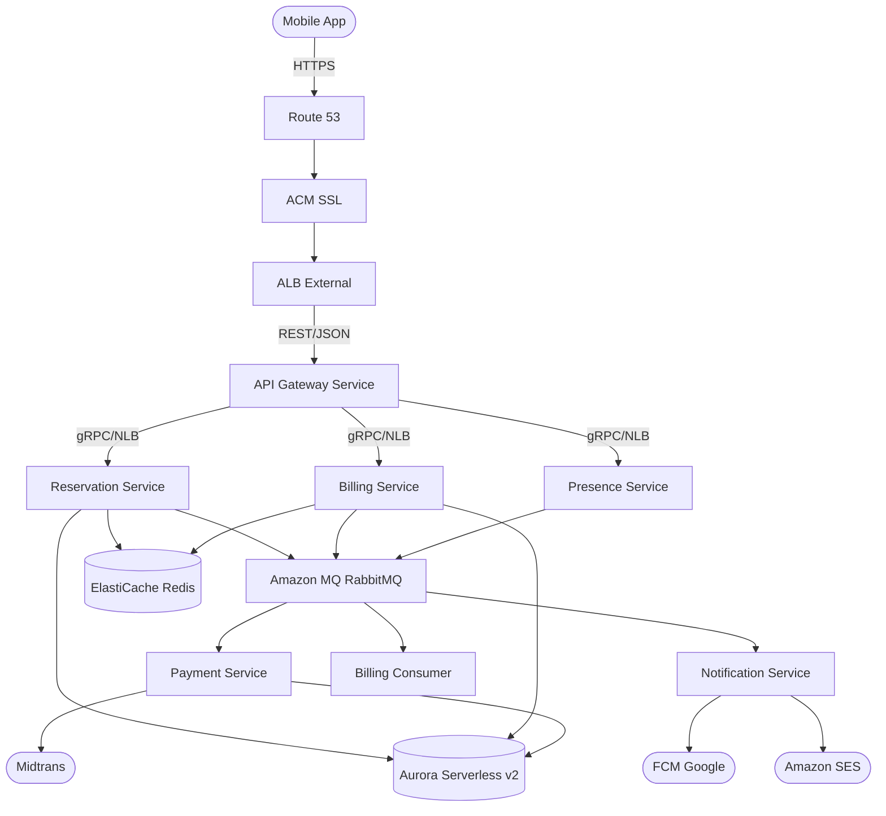
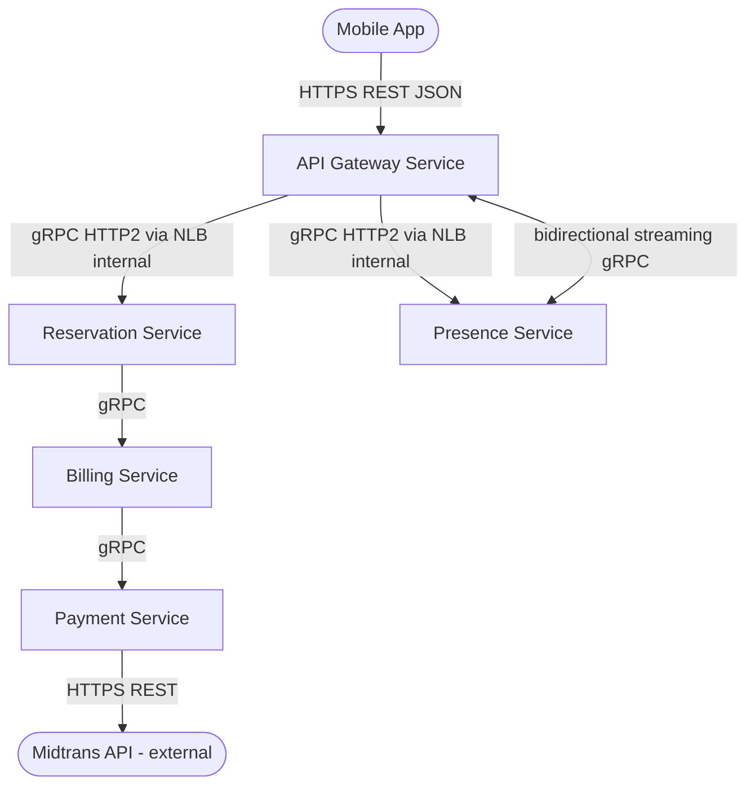
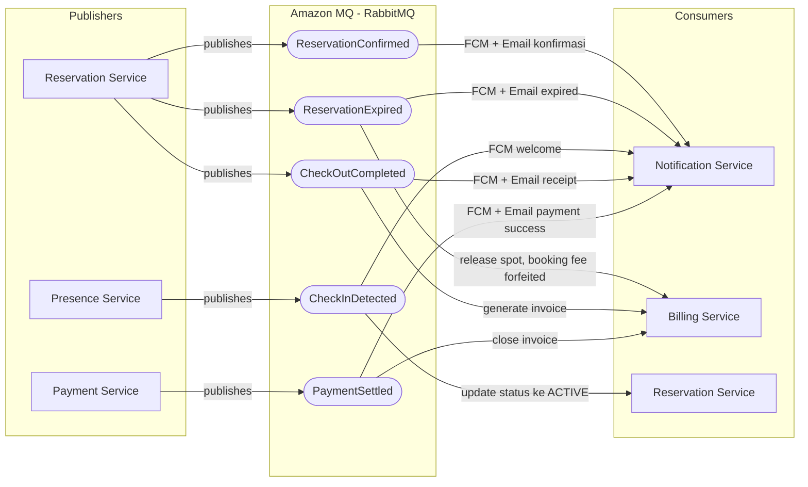
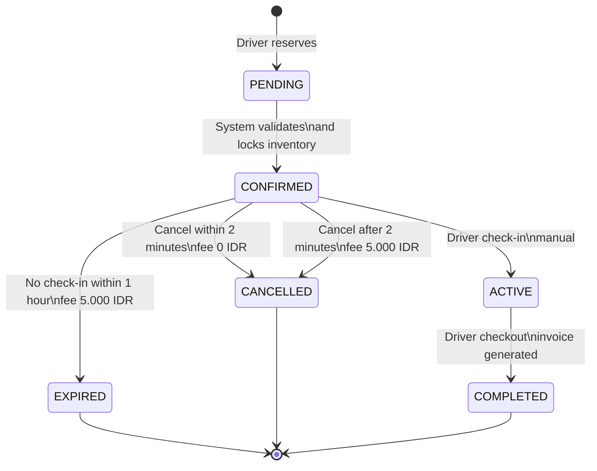
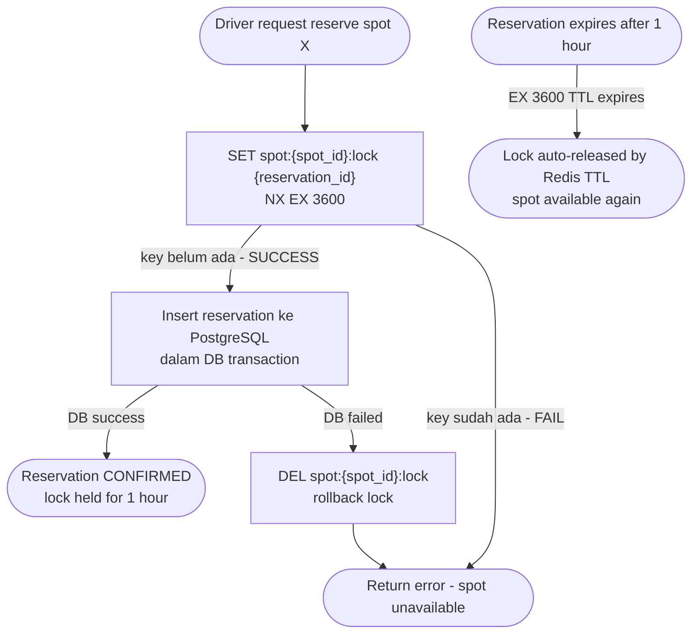
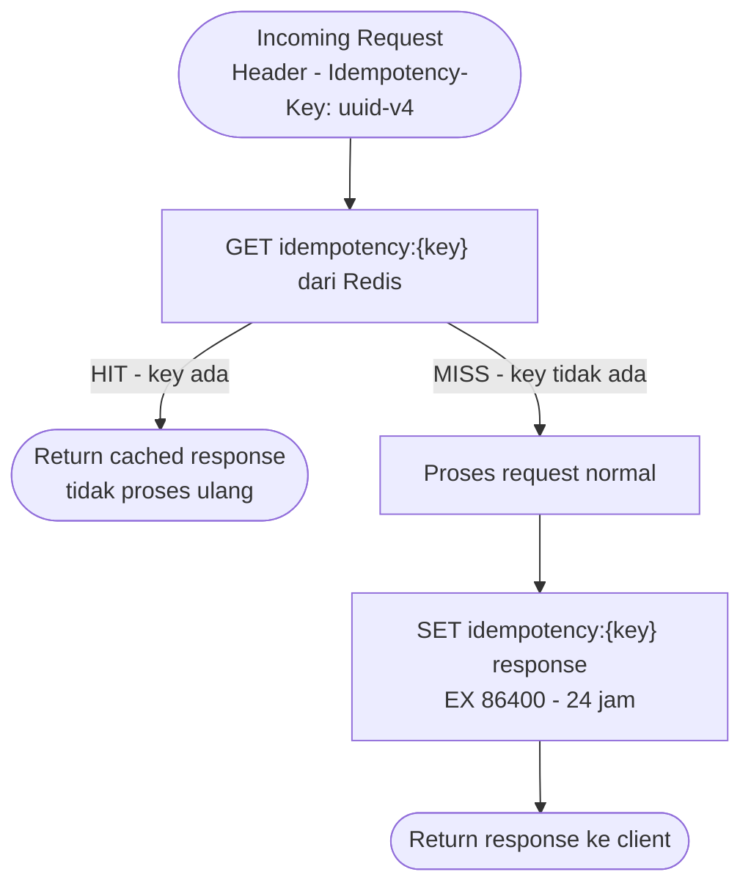
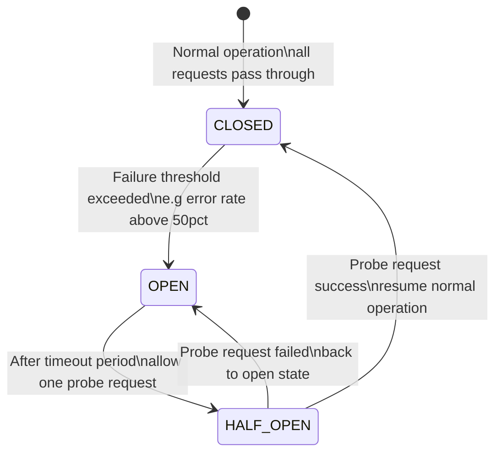

# ParkirPintar - Backend Solution

> Smart Parking Marketplace - Assessment 2026  
> Author: Edy Supardi

---

## 📌 Table of Contents

1. [Project Overview](#1-project-overview)
2. [Assumptions & Constraints](#2-assumptions--constraints)
3. [Capacity Planning](#3-capacity-planning)
4. [High Level Architecture](#4-high-level-architecture-hld)
5. [Low Level Architecture](#5-low-level-architecture-lld)
6. [Architecture Pattern](#6-architecture-pattern)
7. [ERD](#7-erd--entity-relationship-diagram)
8. [Technology Decisions](#8-technology-decisions--justifications)
9. [AWS Infrastructure](#9-aws-infrastructure)
10. [Deployment Strategy](#10-deployment-strategy)
11. [CI/CD Pipeline](#11-cicd-pipeline)
12. [Observability](#12-observability)
13. [Business Rules Reference](#13-business-rules-reference)
14. [Testing Strategy](#14-testing-strategy)
15. [Third-Party Libraries](#15-third-party-libraries--tools)
16. [How to Run](#16-how-to-run)

---

## 1. Project Overview

ParkirPintar adalah sistem smart parking berbasis microservices yang memungkinkan driver mereservasi spot parkir di satu area parkir terpusat. Dibangun sebagai mini app di dalam super app atau sebagai standalone service.

**Karakteristik utama:**
- Single parking area, centralized inventory - 5 lantai, 30 mobil + 50 motor per lantai (total: 150 mobil, 250 motor)
- Reservation dengan Redis inventory lock untuk mencegah double-booking
- Billing dihitung dari actual parking session duration
- Real-time location tracking via presence service
- Payment via Midtrans: QRIS, Virtual Account, GoPay, OVO, Dana
- Notification via FCM (push) dan Amazon SES (email)

---

## 2. Assumptions & Constraints

| # | Asumsi | Alasan |
|---|--------|--------|
| A1 | Sistem hanya melayani 1 area parkir (single-tenant) | Sesuai soal: "single, fixed parking area" |
| A2 | Tidak ada Host onboarding - spot sudah pre-seeded di database | Sesuai soal: "centralized inventory", tidak ada multi-host |
| A3 | Driver diasumsikan sudah authenticated via super app (JWT diterima as-is) | Sesuai soal: "mini app inside a super app" |
| A4 | Geofence / auto check-in tidak diimplementasi — check-in dilakukan manual oleh Driver | Tidak ada di requirement |
| A5 | Timezone sistem adalah WIB (UTC+7) untuk overnight fee | Konteks Jakarta |
| A6 | "Crossing midnight" = session melewati 00:00 WIB | Kalkulasi overnight fee |
| A7 | Satu driver hanya boleh punya 1 active reservation pada satu waktu | Mencegah abuse |
| A8 | System-assigned: pilih lantai terbawah, nomor terkecil yang tersedia | Deterministic dan fair |
| A9 | Midtrans sandbox digunakan untuk demo | Assessment environment |
| A10 | Notification stub menggantikan FCM/SES di environment testing | Kemudahan E2E test |

### Out of Scope
- Multi-area search dan discovery
- Host management dan onboarding
- Dynamic/surge pricing
- Subscription atau membership plans
- Refund processing

---

## 3. Capacity Planning

Dilakukan untuk menjustifikasi keputusan arsitektur - khususnya mengapa tidak butuh infrastruktur yang over-engineered.

```
Total kapasitas    : 400 spot (150 mobil + 250 motor)
Asumsi turnover    : 4x per hari per spot
Total transaksi    : ~1.600 reservasi/hari

Peak hour (08:00–10:00 dan 17:00–19:00):
  ~30% traffic dalam 4 jam = 480 reservasi
  = 120 reservasi/jam peak
  = ~0.033 RPS

Location updates (presence):
  Max active sessions : 400
  Interval            : 30 detik
  = 400 / 30 ≈ 13 writes/detik
```

> Sistem ini adalah **LOW traffic system**. Ini menjustifikasi pilihan ECS Fargate (bukan EKS), Aurora Serverless v2 (bukan RDS provisioned), dan Amazon MQ RabbitMQ (bukan Kafka).

---

## 4. High Level Design (HLD)



### Komponen Utama

| Komponen | Teknologi | Fungsi |
|----------|-----------|--------|
| API Gateway Service | Go + gRPC-gateway | Single entry point, auth, routing |
| Reservation Service | Go + gRPC | Core business: book, cancel, expire |
| Billing Service | Go + gRPC | Pricing engine, invoice generation |
| Payment Service | Go + gRPC | Midtrans integration, webhook handler |
| Presence Service | Go + gRPC streaming | Location tracking, bidirectional streaming |
| Notification Service | Go + gRPC | FCM push + SES email (stub-able) |
| Aurora Serverless v2 | PostgreSQL-compatible | Primary datastore |
| ElastiCache Serverless | Redis 7.x | Distributed lock, idempotency, cache |
| Amazon MQ | RabbitMQ 3.x | Async event bus antar services |

---

## 5. Low Level Design (LLD)

## Service Communication



---

## Event Flow — Async via RabbitMQ



---

## Reservation State Machine



---

## Redis Inventory Lock — Anti Double-Booking



---

## Idempotency Pattern



> Berlaku untuk: `CreateReservation`, `CheckOut/GenerateInvoice`, `CreateTransaction`, `HandleWebhook`

---

## Circuit Breaker — Graceful Degradation



**Non-core service failures** — Notification, Presence:
- Log error, lanjutkan main flow
- Circuit breaker: CLOSED → OPEN → HALF-OPEN
**Core service failures** — Reservation, Billing:
- Return error ke client dengan retry guidance
- Dead letter queue untuk failed events
---

## Pricing Engine Rules

| Rule | Value |
|------|-------|
| Booking fee | 5.000 IDR — charged saat reservation confirmed |
| Hourly rate | 5.000 IDR/jam — first hour + each **started** hour |
| Overnight fee | 20.000 IDR flat — jika session crossing midnight WIB |
| Overstay | Tidak ada penalty — billing normal (hourly rate) |

**Cancellation fee:**

| Kondisi | Fee |
|---------|-----|
| Cancel < 2 menit setelah konfirmasi | 0 IDR |
| Cancel > 2 menit, sebelum check-in | 5.000 IDR |
| No-show > 1 jam tidak check-in | 0 IDR + auto-expire (booking fee 5.000 sudah dibayar saat confirmed) |

**Contoh kalkulasi:**

```
Park 1j 1m:
  parking fee  = ceil(61/60) = 2 jam × 5.000 = 10.000 IDR
  booking fee  = 5.000 IDR
  total        = 15.000 IDR

Park 23:00 – 01:00:
  parking fee  = 2 jam × 5.000 = 10.000 IDR
  overnight    = 20.000 IDR
  booking fee  = 5.000 IDR
  total        = 35.000 IDR
```

---

## 6. Architecture Pattern

Setiap microservice menggunakan **Layered Architecture** dengan dependency flow yang ketat:

```
handler/ → usecase/ → repository/
```

| Layer | Lokasi | Tanggung Jawab |
|-------|--------|----------------|
| `handler/` | `internal/handler/` | Terima gRPC request, validasi input, translate proto ↔ domain |
| `usecase/` | `internal/usecase/` | Business logic dan orchestration — tidak tau detail DB atau gRPC |
| `repository/` | `internal/repository/` | Data access layer — query PostgreSQL dan Redis |
| `domain/` | `internal/domain/` | Struct definitions dan interfaces — zero external dependency |
| `subscriber/` | `internal/subscriber/` | RabbitMQ event consumer — panggil usecase saat terima event |

**Aturan dependency:**
- `handler` boleh panggil `usecase`, tidak boleh langsung query DB
- `usecase` boleh panggil `repository`, tidak boleh tau HTTP/gRPC detail
- `repository` hanya urusan data — tidak ada business logic
- `domain` tidak boleh import package manapun dari project ini

**Struktur per service:**
```
services/{name}/
├── cmd/main.go              ← entry point, wire semua dependency
├── internal/
│   ├── domain/              ← struct + interfaces (zero deps)
│   ├── handler/             ← gRPC handler
│   ├── usecase/             ← business logic
│   ├── repository/          ← data access
│   └── subscriber/          ← MQ event consumer
└── Dockerfile
```

---

## 7. ERD - Entity Relationship Diagram

> Detail ERD: [DB-Diagram](https://dbdiagram.io/d/ParkirPintar-69ecb794c6a36f9c1b7b1899)

```
spots
  ↓
drivers → reservations → location_updates
  ↓           ↓
notif_logs  parking_sessions
                ↓
             invoices
                ↓
             payments
```

---

## 8. Technology Decisions & Justifications

| Komponen | Pilihan | Alternatif | Alasan |
|----------|---------|------------|--------|
| Container | ECS Fargate | EKS, GKE | EKS charge $73/bln hanya control plane. Capacity planning menunjukkan ~0.033 RPS - ECS Fargate jauh lebih cost-efficient untuk skala ini |
| Database | Aurora Serverless v2 | RDS PostgreSQL, DynamoDB | Traffic bersifat peak-hour. Aurora scale 0.5–128 ACU otomatis. DynamoDB tidak cocok untuk skema relasional kompleks ini |
| Cache/Lock | ElastiCache Serverless Redis | Memcached, self-hosted Redis | Redis SET NX adalah primitive paling tepat untuk distributed lock. Soal secara eksplisit menyebut Redis-based lock |
| Message Queue | Amazon MQ (RabbitMQ) | Kafka (MSK), SQS+SNS | Kafka untuk jutaan events/detik. Sistem ini ~1.600 events/hari - Kafka over-engineering. RabbitMQ AMQP lebih fleksibel dari SQS untuk fan-out pattern |
| Load Balancer | ALB (external) + NLB (internal) + client-side LB | ALB only, App Mesh | NLB TCP pass-through untuk gRPC internal dikombinasikan dengan client-side load balancing (DNS round-robin via ECS Service Discovery). ALB untuk REST external karena support WAF dan routing rules. ALB internal bisa distribute gRPC lebih merata tapi tambah latency dan cost — trade-off yang tidak worth untuk skala ini |
| Payment | Midtrans | Xendit, Stripe | Stripe tidak support QRIS/VA Indonesia/e-wallet lokal. Midtrans cover semua dalam satu integrasi|
| IaC | Terraform | AWS CDK, CloudFormation | Industry standard, multi-cloud, AWS provider paling mature, paling mudah di-review oleh siapapun |
| Notification | FCM + Amazon SES | AWS SNS, SendGrid | FCM standard untuk mobile push. SES murah ($0.10/1000 email), native AWS, bounce handling otomatis |

---

## 9. AWS Infrastructure

### Services

| AWS Service | Fungsi | Tier / Sizing |
|-------------|--------|---------------|
| ECS Fargate | Container runtime | Per-task billing |
| Aurora Serverless v2 | Primary PostgreSQL | 0.5–4 ACU auto-scale |
| ElastiCache Serverless | Redis lock + cache | On-demand |
| Amazon MQ | RabbitMQ event broker | mq.t3.micro |
| ALB | External HTTPS load balancer | - |
| NLB | Internal gRPC load balancer | - |
| ECR | Docker image registry | - |
| Route 53 | DNS | - |
| ACM | SSL certificate | Free |
| CloudWatch | Logs + metrics + alarms | - |
| AWS X-Ray | Distributed tracing | - |
| Secrets Manager | DB creds, API keys | - |

### Estimasi Biaya (Dev Environment)

| Komponen | Est./bulan |
|----------|------------|
| ECS Fargate (6 services, minimal) | ~$30–50 |
| Aurora Serverless v2 (0.5 ACU idle) | ~$20–30 |
| ElastiCache Serverless | ~$10–15 |
| Amazon MQ t3.micro | ~$15 |
| ALB + NLB | ~$20 |
| ECR, CloudWatch, misc | ~$10 |
| **Total Dev** | **~$105–140/bln** |

### Terraform Structure

```
terraform/
├── versions.tf
├── variables.tf
├── modules/
│   ├── networking/      ← VPC, subnets, security groups
│   ├── ecs/             ← Cluster, task definitions, services
│   ├── rds/             ← Aurora Serverless v2
│   ├── elasticache/     ← Redis Serverless
│   ├── load-balancer/   ← ALB + NLB
│   ├── mq/              ← Amazon MQ
│   └── monitoring/      ← CloudWatch + alarms
└── environments/
    ├── dev/             ← minimal sizing
    └── prod/            ← production sizing + auto-scaling
```

---

## 10. Deployment Strategy

| Environment | Strategy | Alasan | Trade-off |
|-------------|----------|--------|-----------|
| Development | Recreate | Clean state setiap deploy menyederhanakan debugging | Downtime ~10 detik saat deploy |
| Staging | Rolling Update | Mirror production behavior, zero downtime | Dua versi bisa berjalan bersamaan sebentar — acceptable di staging |
| Production (app) | Canary | Validasi gradual sebelum full rollout, rollback cepat jika ada issue | Butuh monitoring yang proper, sedikit lebih lambat rollout |
| Production (infra) | Blue/Green | Rollback instant untuk perubahan besar seperti DB migration atau config change | 2x infrastructure cost sementara selama cutover |

### Canary Flow

```
Deploy v2 ke 10% traffic
  → Monitor 30 menit
  → Error rate < 1%? Lanjut ke 50%
  → Error rate > 5%? Auto-rollback ke v1

Deploy v2 ke 50% → Monitor → 100%
```

---

## 11. CI/CD Pipeline

```
feature branch push
  ├── Lint (golangci-lint)
  ├── Unit tests
  └── Build Docker image

PR ke develop
  ├── Code review
  └── Merge → auto deploy staging
              ├── E2E tests
              └── Security scan (trivy)

PR ke main
  └── Canary deploy production
      └── Auto-rollback jika error rate > threshold
```

Path-based trigger: hanya service yang berubah yang di-build ulang.

---

## 12. Observability

### The 4 Golden Signals

| Signal | Metric | Alert |
|--------|--------|-------|
| Latency | P99 reservation API | > 500ms |
| Traffic | RPS per service | Spike > 3x baseline |
| Errors | Error rate | > 1% warning, > 5% critical |
| Saturation | CPU ECS task, Redis memory | CPU > 80%, Redis > 70% |

### Tools

| Tool | Fungsi |
|------|--------|
| CloudWatch Logs | Centralized logs dari semua ECS tasks |
| CloudWatch Metrics | Infrastructure metrics |
| CloudWatch Alarms | Alert + auto-scaling trigger |
| AWS X-Ray | Distributed tracing - request dari Gateway ke Billing |
| OpenTelemetry SDK | Instrumentasi kode, vendor-neutral |

---

## 13. Business Rules Reference

### Pricing

| Rule | Value |
|------|-------|
| Booking fee | 5.000 IDR (saat reservation confirmed) |
| Hourly rate | 5.000 IDR/jam (first + each started hour) |
| Overnight fee | 20.000 IDR flat (crossing midnight WIB) |
| Overstay penalty | Tidak ada - billing normal |

### Cancellation Policy

| Kondisi | Fee |
|---------|-----|
| < 2 menit setelah konfirmasi | 0 IDR |
| > 2 menit, sebelum check-in | 5.000 IDR |
| No-show (> 1 jam tidak check-in) | 5.000 IDR + auto-expire |

### Reservation Rules

| Rule | Value |
|------|-------|
| Hold time | 1 jam setelah confirmation |
| Assignment modes | System-assigned atau User-selected |

---

## 14. Testing Strategy

### Unit Tests - `pkg/`

Target coverage: > 80% untuk business logic packages.

```
pkg/pricing/
  TestPricingEngine_BookingFee
  TestPricingEngine_HourlyRate_ExactHour
  TestPricingEngine_HourlyRate_StartedHour      ← 1j 1m = 2 jam
  TestPricingEngine_OvernightFee_CrossingMidnight
  TestPricingEngine_OvernightFee_SameDay
  TestPricingEngine_CancellationFee_Under2Min
  TestPricingEngine_CancellationFee_Over2Min
  TestPricingEngine_NoShow_NoExtraCharge
  TestPricingEngine_Overstay_NoPenalty

pkg/lock/
  TestRedisLock_AcquireSuccess
  TestRedisLock_AcquireFail_AlreadyLocked
  TestRedisLock_AutoExpiry

pkg/idempotency/
  TestIdempotency_FirstRequest_Processed
  TestIdempotency_DuplicateRequest_ReturnCached
```

### Integration Tests

```
Reservation → Billing flow (full DB transaction)
Payment webhook → Billing MarkPaid flow
Event publishing dan consuming via RabbitMQ
```

### End-to-End Scenarios

| # | Skenario |
|---|----------|
| E2E-01 | Happy path reservation → check-in → check-out → pay |
| E2E-02 | Double-book prevention - spot sama ditolak |
| E2E-03 | User-selected spot contention - queue mechanism |
| E2E-04 | Reservation expiry (no-show) - auto-expire, booking fee forfeited, no extra charge |
| E2E-05 | Cancellation < 2 menit - fee 0 IDR |
| E2E-06 | Cancellation > 2 menit - fee 5.000 IDR |
| E2E-07 | Extended stay (overstay) - normal rate, no penalty |
| E2E-08 | Overnight fee - crossing midnight +20.000 IDR |
| E2E-09 | Payment QRIS - success |
| E2E-10 | Payment QRIS - failure |
| E2E-11 | Payment Virtual Account - VA number + polling fallback |
| E2E-12 | Duplicate webhook - idempotent, no double-charge |

---

## 15. Third-Party Libraries & Tools

| Library | Fungsi | Justifikasi |
|---------|--------|-------------|
| `google.golang.org/grpc` | gRPC framework | Required by soal |
| `google.golang.org/protobuf` | Protobuf serialization | Required by gRPC |
| `github.com/grpc-ecosystem/grpc-gateway/v2` | gRPC ↔ REST transcoding | Single codebase untuk dua protokol |
| `github.com/rs/zerolog` | Structured logging | Zero allocation, JSON output |
| `github.com/spf13/viper` | Config management | Multi-source: env, file, remote |
| `github.com/redis/go-redis/v9` | Redis client | Official client, full-featured |
| `github.com/rabbitmq/amqp091-go` | RabbitMQ client | Official AMQP client |
| `github.com/jackc/pgx/v5` | PostgreSQL driver | Performa lebih baik dari lib/pq |
| `github.com/golang-migrate/migrate/v4` | DB migrations | Version control untuk schema |
| `github.com/sony/gobreaker` | Circuit breaker | Graceful degradation |
| `go.opentelemetry.io/otel` | Distributed tracing | Vendor-neutral, industry standard |
| `firebase.google.com/go/v4` | FCM push notification | Official Firebase SDK |
| `github.com/aws/aws-sdk-go-v2` | AWS SDK (SES) | Official AWS SDK |
| `github.com/midtrans/midtrans-go` | Payment gateway | Official Midtrans Go SDK |
| `github.com/google/uuid` | UUID generation | Standard UUID v4 |
| `github.com/stretchr/testify` | Testing assertions | Standard di ekosistem Go |
| `github.com/testcontainers/testcontainers-go` | Integration testing | Real DB/Redis di test |

---

## 16. How to Run

### Prerequisites

- Go 1.22+
- Docker & Docker Compose
- `buf` CLI untuk proto generation
- `golang-migrate` CLI untuk database migration

### Quick Start

```bash
# 1. Clone repository
git clone https://github.com/edysupardi/parkirpintar.git
cd parkirpintar

# 2. Copy environment config
cp .env.example .env
# Edit .env sesuai kebutuhan

# 3. Start dependencies
make deps-up

# 4. Generate proto
make proto

# 5. Run migrations
make migrate-up

# 6. Seed parking spots (400 spots)
make seed

# 7. Run semua services
make run-all
```

### Run Tests

```bash
make test-unit          # unit tests (pkg/)
make test-integration   # integration tests
make test-e2e           # semua 13 e2e scenarios
make test-coverage      # coverage report → coverage.html
```

### Environment Variables

Lihat `.env.example` untuk daftar lengkap semua konfigurasi yang diperlukan.